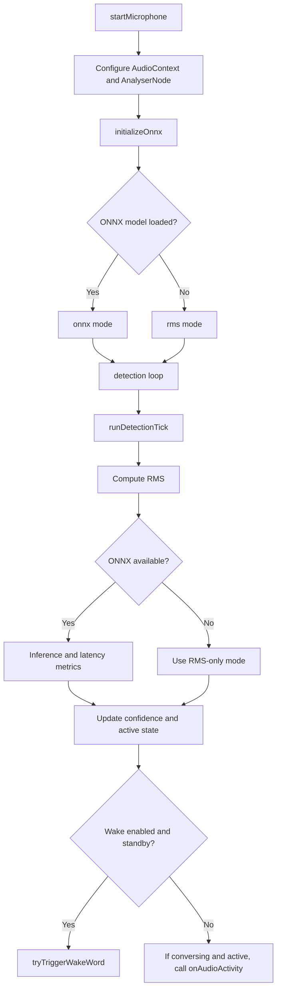

# WakeWordDetectorService

## Overview

WakeWordDetectorService manages microphone capture, RMS energy analysis, and ONNX inference for real-time voice activity detection.

## Responsibilities

- Start and stop the audio pipeline (`getUserMedia`, `AudioContext`, `AnalyserNode`).
- Execute the periodic detection loop with safe fallback behavior.
- Expose reactive detector state signals (mode, confidence, latency, and errors).
- Trigger wake-word state transitions through WakeWordStateService.

## Inputs and Outputs

- Inputs:
  - Microphone audio stream.
  - Socket and wake state from WakeWordStateService.
  - ONNX model at `/models/silero-vad.onnx`.
- Outputs:
  - Public signals (`detectorMode`, `voiceLevel`, `onnxConfidence`, `lastInferenceMs`, `inferenceAvgMs`, `inferenceMaxMs`, `errorMessage`).
  - Transition callbacks (`onWakeWordDetected`, `onAudioActivity`).

## Main Flow



## Error Handling and Edge Cases

- Microphone permission failures set `micStatus = error` with a user-facing error message.
- ONNX loading or inference failures automatically switch to `rms` mode.
- Supports both ONNX state formats:
  - `input/state` + `output/stateN`
  - `input/h,c` + `output/hn,cn`
- `stopMicrophone()` clears timers, media tracks, audio context, and accumulated metrics.

## Examples

```ts
await wakeWordDetectorService.startMicrophone();

const mode = wakeWordDetectorService.detectorMode();
const confidence = wakeWordDetectorService.onnxConfidence();
const avgMs = wakeWordDetectorService.inferenceAvgMs();

wakeWordDetectorService.stopMicrophone();
```

## Dependencies and Integrations

- WakeWordStateService for conversation state transitions.
- `onnxruntime-web` for WASM inference.
- Web APIs: `AudioContext`, `AnalyserNode`, `getUserMedia`.
