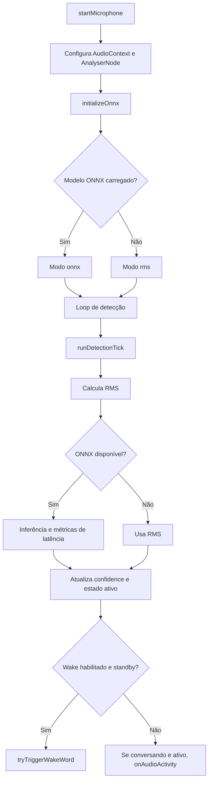

# WakeWordDetectorService

## Visão geral

O WakeWordDetectorService gerencia captura de áudio do microfone, cálculo de energia (RMS) e inferência ONNX para detecção de atividade de voz em tempo real.

## Responsabilidades

- Inicializar e encerrar pipeline de áudio (`getUserMedia`, `AudioContext`, `AnalyserNode`).
- Executar loop periódico de detecção com fallback seguro.
- Publicar sinais reativos de estado do detector (modo, confiança, latência e erros).
- Acionar transições no estado de wake word via `WakeWordStateService`.

## Entradas e saídas

- Entradas:
  - Fluxo de áudio do microfone.
  - Estado do socket e wake word via `WakeWordStateService`.
  - Modelo ONNX em `/models/silero-vad.onnx`.
- Saídas:
  - Signals públicas (`detectorMode`, `voiceLevel`, `onnxConfidence`, `lastInferenceMs`, `inferenceAvgMs`, `inferenceMaxMs`, `errorMessage`).
  - Chamadas de transição (`onWakeWordDetected`, `onAudioActivity`).

## Fluxo principal



## Tratamento de erros e casos-limite

- Falha de permissão no microfone define `micStatus = error` e mensagem amigável.
- Falha de carga/inferência ONNX ativa fallback para modo `rms` sem interromper detecção.
- Suporte de compatibilidade para modelos ONNX com dois formatos de estado:
  - `input/state` + `output/stateN`.
  - `input/h,c` + `output/hn,cn`.
- `stopMicrophone()` limpa timers, tracks, contexto de áudio e métricas acumuladas.

## Exemplos

```ts
await wakeWordDetectorService.startMicrophone();

const mode = wakeWordDetectorService.detectorMode();
const confidence = wakeWordDetectorService.onnxConfidence();
const avgMs = wakeWordDetectorService.inferenceAvgMs();

wakeWordDetectorService.stopMicrophone();
```

## Dependências e integrações

- `WakeWordStateService` para transições do fluxo de conversa.
- `onnxruntime-web` para inferência WASM.
- APIs WebAudio (`AudioContext`, `AnalyserNode`) e MediaDevices (`getUserMedia`).
